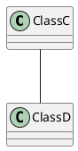

# Assoziation und Aggregation

Assoziation ist eine Beziehung zwischen zwei oder mehr Klassen

## Assoziation

Die Klassen C und D stehen in Beziehung:

```plantuml
@startuml
ClassC -- ClassD
@enduml
```
