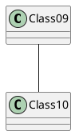
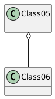
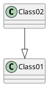
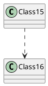

# Assoziation und Aggregation

Assoziation ist eine Beziehung zwischen zwei oder mehr Klassen

## Assoziation

Die Klassen `Class09` und `Class10` stehen in Beziehung:

## Aggregation

Jedes Objekt von `Class05` enthält Objekte von `Class06`:

## Vererbung

Die Klasse `Class02` ist Erbe der Klasse `Class01`:

## Abhängigkeit

Die Klasse `Class15` benutzt Elemente der Klasse `Class16` (z.B. Methoden):

## List of references

- [Microsoft PowerPoint - Folien07.ppt](https://www.dbs.ifi.lmu.de/Lehre/NFInfoSW/WS0708/Skript/Folien07.pdf)

powered by

- [PlantUML Visualizer – Get this Extension for 🦊 Firefox (en-US)](https://addons.mozilla.org/en-US/firefox/addon/plantuml-visualizer/?utm_source=addons.mozilla.org&utm_medium=referral&utm_content=search)
- [PlantUML Visualizer - Chrome Web Store](https://chrome.google.com/webstore/detail/plantuml-visualizer/ffaloebcmkogfdkemcekamlmfkkmgkcf/related)
